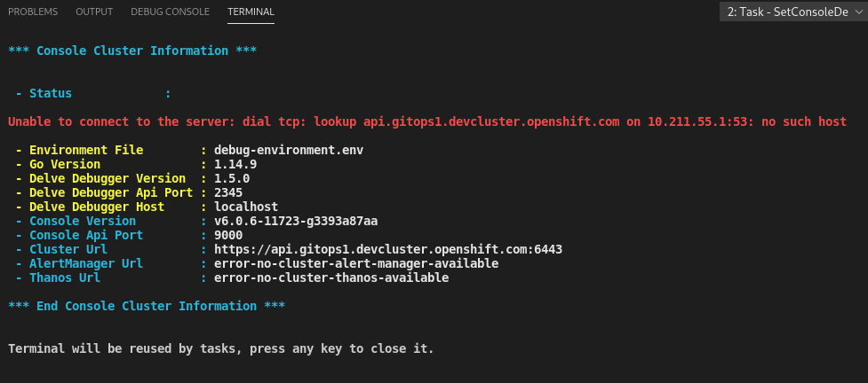

# Openshift Console Debugging
Shell scripts that setup an integrated debugging experience for the [Openshift console](https://github.com/openshift/console) in VSCode.

# Instructions
## 1) Read [Debugging The Openshift Console](./docs/debugging/)
  This information will help you to understand how go debugging works in both VSCode and the terminal, and how that information is used to setup integrated VSCode debugging for the openshift console. This information also describes the purpose of each of the scripts that are downloaded in step 2 below. If this information is superfulous for you, then just skip this and go to step 2.

## 2) Run the VSCode Debugging Setup Script
  From the console VSCode <span style="color:red">**workspace folder**</span>, paste the following into a macOS Terminal or Linux shell prompt and press return. Its probably a good idea to do this on a seperate branch to ensure the scripts dont get checked into the master or primary branch.
  ```sh
  /bin/bash -c "$(curl -fSLO raw.githubusercontent.com/mitchharpur/openshift-console-debugging/master/debug-download.sh ; chmod u+x debug-download.sh ; )"; ./debug-download.sh;  ./debug-setup.sh


  ```
  The result or outcome of running this script will be debug drop down options in VSCode that will offer the options to launch the go console backend in debugging mode (as shown below). By setting a break point in the go file of choice, an integrated VSCode debugging experience will now be possible. As long as a cluster has been logged into there should be no need for any other steps for an integrated VSCode debugging experience.

  

  When debug run is pressed the VSCode integrated terminal will contain the information about the cluster that the console is connect to.

  


  - <span style="color:red;">***Note :***</span> You must be logged in to an openshift cluster. Get the login command with token from the user interface. It should resemble something similar to the following:
  ```sh
  oc login
  --token=7dDyxSKIumWvfkCWcwM_9A2vtwx8YiNEZsm9yyh-Ad0 --server=https://api.gitops2.devcluster.openshift.com:6443
  ```

  In order to get this token , the correct login command can be retrieved from the openshift console as shown below

  

  Click the link shown after selecting 'Copy Login Command'

  

  The result will be the correct login command that you can enter into the terminal of VSCode or another open terminal.

  


