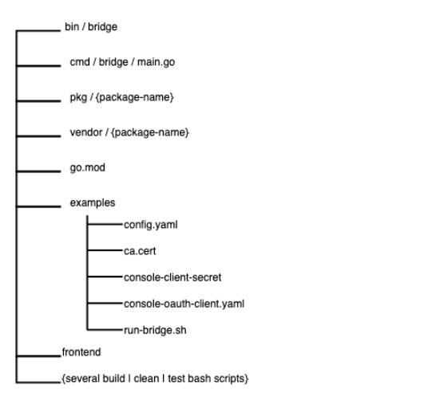

# Repository

The console's [git repository](https://github.com/openshift/console) is a [monorepo](https://en.wikipedia.org/wiki/Monorepo) that contains the source code for the web application (front end) as well as the source code for the cluster proxy (backend). It is helpful how the major pieces fit together and how the repository is structured. From a development perspective, this is important because it impacts how to debug the application. It also impacts how the artifacts created from a build are arranged. These artifacts are important when debugging the application because metadata about them is usually encoded into distributed runtime artifacts. 

# Repository Structure

It is helpful to have a basic understanding of the console repository structure. There are a lot of files in the repository, but there are certain key files that serve as ‘entry’ points from a logical code flow perspective. Knowing these key entry points is helpful to understanding a high level overview of the console monorepo paradigm. Remember that a monorepo means that both the typescript web application and the go bridge binary source code are all together in the same repository. Normally projects are separated by language. Not so here. The key parts of the repository are outlined below:

## 1) Frontend :A Typescript React Web Application
The web application files are in the **frontend** folder. The frontend is built using the build-frontend.sh script.

## 2) Backend: A go Cluster Proxy API Server
The proxy go executable main package source is in the cmd/bridge/main.go file. This is the entry point for the backend. When this package is compiled, the bridge executable binary is compiled and placed into the bin/ folder. Other packages are pulled in from pkg and the vendor folders.

## 3) Shell Scripts
There are several Bash scripts: 
- build | clean | test | run | deploy 

These scripts are in the repo root and are used to either build|test|run|deploy the application.

The bridge executable is launched using the examples/run-bridge.sh script and uses the certificates and secret files in that folder. 

These certificates and secrets need to be updated every time the user logs in to a cluster, because an API bearer token is used in making API requests from the web application to the cluster proxy.

## 4) Debugging Shell Scripts
The scripts used to debug the application are actually part of [this](https://github.com/mitchharpur/openshift-console-debugging) repository. These scripts are added to the console project using the instructions outlined [here](https://github.com/mitchharpur/openshift-console-debugging/tree/master/docs/debugging) . These scripts all sctart with debug-* and add a .vscode folder to the projects in order to setup integrated debugging in VSCode.