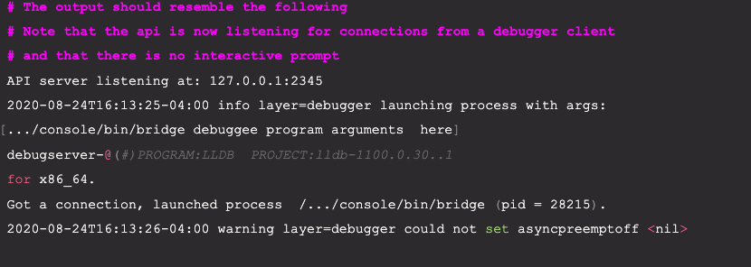

# Debugging Go from the terminal
In order to debug a go program  from the terminal, there are two scenarios:
1) ### Launch
>Compile and lauch the binary in debug mode in one step.
2) ### Attach
>Attach the debugger to an already running go program that has been compiled with optimizations disabled.

## 1) Launch
To compile, launch, and debug a Go program from the terminal in one step, you can use the [dlv debug](https://github.com/go-delve/delve/blob/master/Documentation/usage/dlv_debug.md) command. 

It’s the easiest way to debug from the terminal. 

The dlv debug command automatically disables optimizations when compiling, so there is no need to remember which build flags to use. 

The delve debugger can be launched in **headless** mode or in **interactive** mode. 

**Interactive mode** means that interacting with the debugger is done directly from the terminal used to lauch the debug session.
**Headless mode** means that a seperate **debugger client** is used to interact with the debugger

VS Code can be used as a debugger client when the [Go for VS Code extension](https://marketplace.visualstudio.com/items?itemName=golang.go) is installed. 

The delve debugger can also function as a terminal based debugger client to an existing debugging session. This is achieved by using the **delve connect** command to connect to the debugging session running in headless mode in another terminal. It could be on the same machine or a remote machine, as long as the ports are accessible and there is an awareness of the security implications of exposing the debugger api port.

### Interactive Mode

To start an **interactive** terminal based debug session, type the following:

This command will compile the **main package** in *./cmd/bridge/main.go* to the *./bin/bridge* executable, and it will then automatically **launch** the executable into a **paused** state with the debugger attached to the running process.

This will produce an *interactive terminal* output something resembling the following:

At this point it is possible interact with the debugger.

Other interactions with the debugger are outlined [here](https://github.com/go-delve/delve/blob/master/Documentation/cli/README.md) .

In this **interactive mode** , direct interaction with the debugger is enabled. 

### Headless mode
When the debugger is launched in **headless mode**, then it functions more like a server that can receive debugger commands.

In this **headless mode**, the debugger exposes a debugging api that can be accessed using a **debugger client**. A debugger client sends commands to the debugger to control the debugging session. VS Code can function as a debugger client. In order to do this it is necessary to [install the go extensions for VS Code](https://marketplace.visualstudio.com/items?itemName=golang.Go). This extension automatically launches the delve debugger in headless mode and [connects to the api](https://github.com/go-delve/delve/tree/master/Documentation/api), providing a great debugger-client experience. [JetBrains Goland can do the same](https://www.jetbrains.com/help/go/debugging-code.html). 

The IDE’s mentioned have the capability to automatically launch the delve debugger, but you may want more fine grained control over this experience. To manually launch the delve debugger in headless mode, you must use the --headless flag. The --accept-multiclient flag is also used if there is a need to *simultaneously connect several debugger clients* to the debugger (i.e both the IDE and the delve terminal client). Finally, the --listen flag allows a specific location and port to be used to expose the API. This is specifically helpful when remote debugging, where firewall restrictions may be in place. Note that it is not secure.

Running in **headless** mode would look something like this:

Note that if the program being debugged (the debuggee) has any arguments, you would add them after the -- separator as highlighted in the above example . The bridge executable has several arguments, as shown in ./examples/run-bridge.sh. file

At this point you can connect to the headless server using the **delve connect** command

In the headless scenarios mentioned above, the debugger  is now:
- listening on port  2345  for any extra debugger clients (for --accept-multiclient )
- using  v2  of the api
- running in headless mode and accept connections from multiple clients 
- logging output to the terminal
- started in the paused state (adding the --continue flag will start executing the code immediately)
- The debugger client ( VSCode, delve ,Jetbrains etc) issues debugging commands through the api

Once the debugger client is connected, you can continue to set break-points, step through the code, etc. 
Commands: 
- **c** - will continue execution of the executable
- **r** - will restart the debuggee process
- **b** main.main and then c - will set a breakpoint on the main package and continue to that point
Subsequent n - will step through the code. 
- **p** [variable name] - will print the value of the variable 
- **q** - will quit the debugging session. Note: If you are connected to a headless delve process via the dlv connect, typing q will prompt to end the headless server too.

The meaning of the various dlv debug flags are explained in more detail [here](https://github.com/go-delve/delve/blob/master/Documentation/usage/dlv.md).

Interacting with a debugger from the terminal is outlined in more detail [here](https://github.com/go-delve/delve/blob/master/Documentation/cli/README.md).

## 2) Attach

The [delve attach](https://github.com/go-delve/delve/blob/master/Documentation/usage/dlv_attach.md) command enables the capability to debug a running process.
To manually attach to a running Go binary, if possible and for best results, first compile the binary with optimizations disabled:

